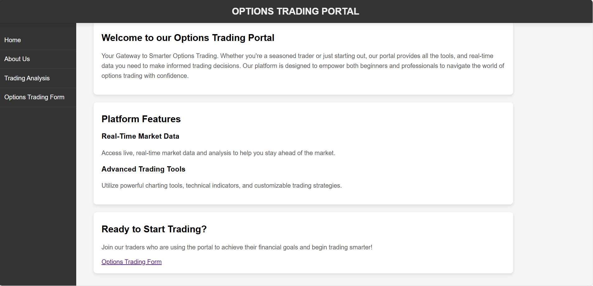
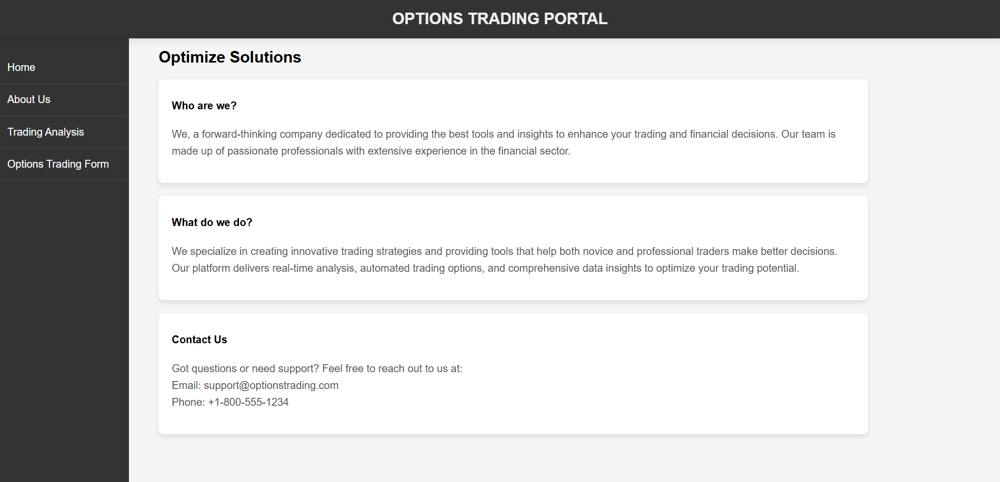
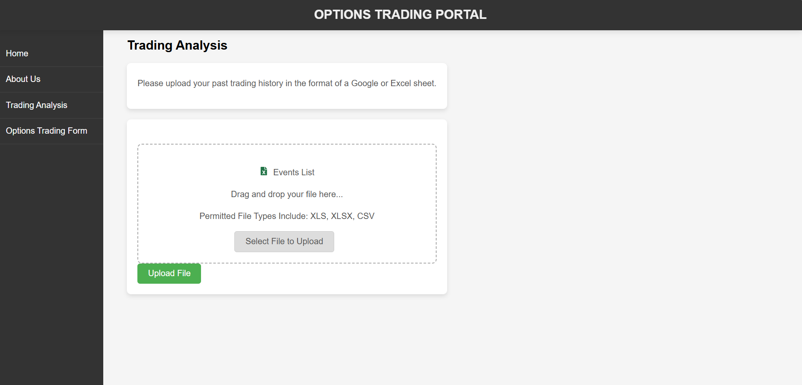
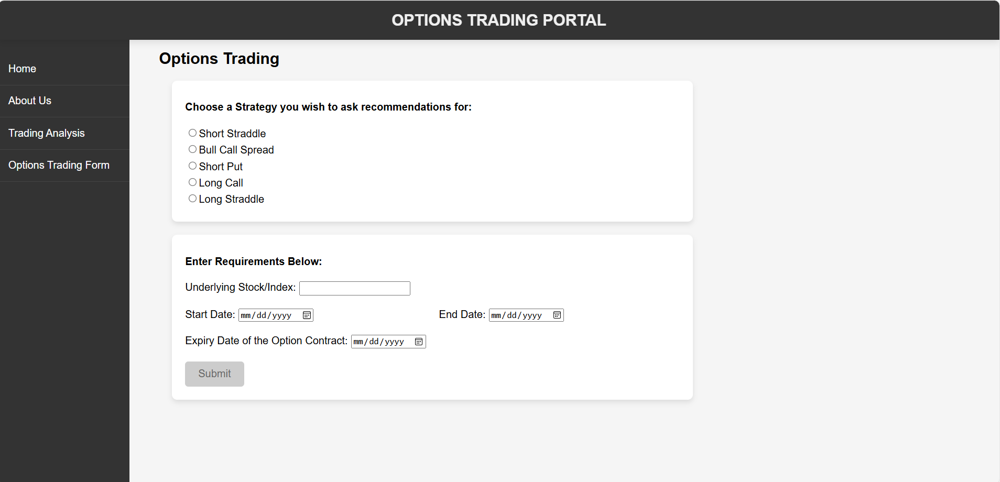
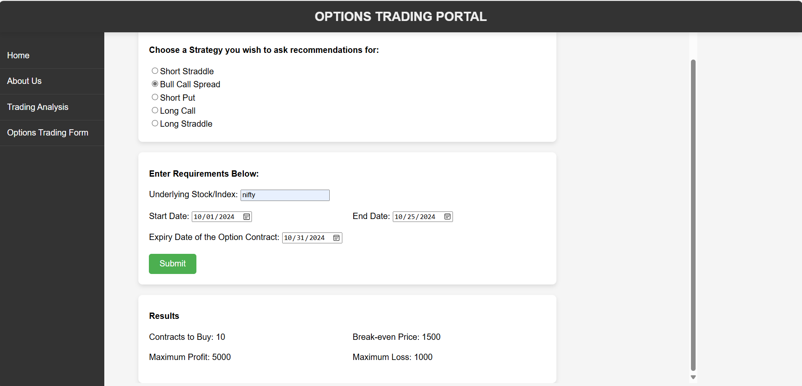

# Options Trading Portal React App

Your Gateway to Smarter Options Trading. Whether you're a seasoned trader or just starting out, our portal provides all the tools, and real-time data you need to make informed trading decisions. Our platform is designed to empower both beginners and professionals to navigate the world of options trading with confidence.

After cloning the repository, run the following command to install dependencies:

### `npm install`

This command will download all necessary dependencies listed in package.json.

## Available Scripts

In the project directory, you can run:

### `npm start`

Runs the app in the development mode.\
Open [http://localhost:3000](http://localhost:3000) to view it in your browser.

The page will reload when you make changes.\
You may also see any lint errors in the console.

### `npm run build`

Builds the app for production to the `build` folder.\
It correctly bundles React in production mode and optimizes the build for the best performance.

The build is minified and the filenames include the hashes.\
Your app is ready to be deployed!
